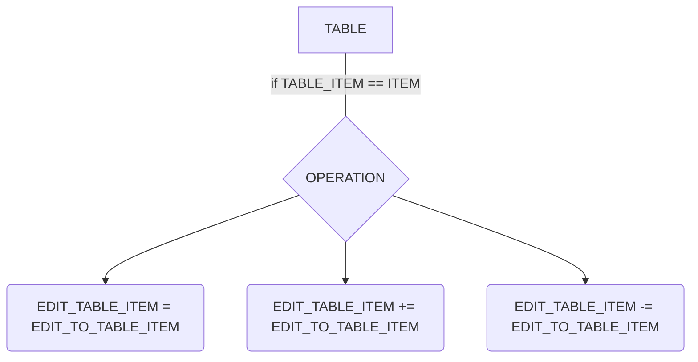

# OnlineSQL-PY-math
This script helps you in MySQL online connection


## Instalation
### Download libraries

###### DateTime
```
pip install datetime
```
###### PyMySQL
```
pip install pymysql
```

### Add util in project
Download **main.py** and drop in project folder. *Recommend: rename file*

###### In your project import he
```py
from main import MYSQL_TOOLZ
```

Open library file (main.py) and edit **db_config** and **table**

###### EXAMPLE
```py
db_config = {
    "host": "127.0.0.1",
    "user": "admin",
    "password": "1234567890",
    "db": "mydatabase",
    "port": 3333
}
table = "profiles"
```

## Using

###### Get all table (fetched)
```py
TABLE = MYSQL_TOOLZ.get_all()
```

### Updater
Helps you edit table by math operation + - =

##### Use:
```py
MYSQL_TOOLZ.update(TABLE, TABLE_ITEM, ITEM, EDIT_TABLE_ITEM, EDIT_TO_TABLE_ITEM, OPERATION)
```
TABLE - Table

 

TABLE_ITEM - Column name (for search)

ITEM - Variable (for comparison TABLE_ITEM)

 

EDIT_TABLE_ITEM - Colum name (for edit)

EDIT_TO_TABLE_ITEM - Variable (for edit value of EDIT_TABLE_ITEM)



###### EXAMPLE: =

db
```
{                        ->   {
  'profile_id': '15',    ->     'profile_id': '15',
  'level': '10'          ->     'level': '27'
}                        ->   }
```

function
```py
MYSQL_TOOLZ.update(MYSQL_TOOLZ.get_all(), 'profile_id', 15, 'level', 27, '=')
```

###### EXAMPLE: -

db
```
{                        ->   {
  'profile_id': '15',    ->     'profile_id': '15',
  'level': '10'          ->     'level': '-17'
}                        ->   }
```

function
```py
MYSQL_TOOLZ.update(MYSQL_TOOLZ.get_all(), 'profile_id', 15, 'level', 27, '-')
```
###### EXAMPLE: +

db
```
{                        ->   {
  'profile_id': '15',    ->     'profile_id': '15',
  'level': '10'          ->     'level': '37'
}                        ->   }
```

function
```py
MYSQL_TOOLZ.update(MYSQL_TOOLZ.get_all(), 'profile_id', 15, 'level', 27, '+')
```
